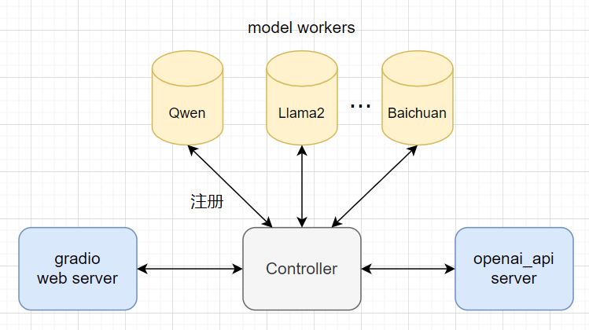

# 模型部署分享
## FastChat 架构
fastchat 由四个组件组成，分别为
- gradio web server 用于简单的 UI 交互
- Controller 用于管理 `model worker` 的模型名和模型地址
- openai_api server 提供与 **openai** 兼容的 API
- model worker 运行大模型，定时向 Controller 发送心跳

组件的启动顺序是先启动 `Controller` 模块，用于 model-worker 的注册信息。其次是 `model worker`，运行大模型，最后是 `gradio web server` 和 `openai_api server` 。

### model worker 主要参数
`--gpus`: A single GPU like 1 or multiple GPUs like `0,2`

`--max-gpu-memory`: 单个 gpu 最大的显存使用量

`--controller-address`: Controller 地址

`--limit-worker-concurrency`: 防止 OOM

### gradio web server 主要参数
`--model-list-mode`: once or reload. 加载模型列表一次或者每次都加载

## conversation template

## openai api

## tokenizer