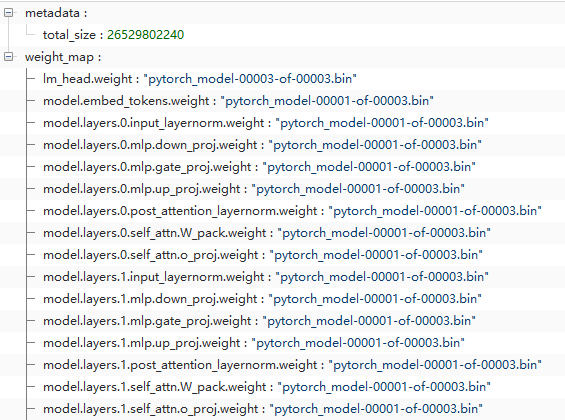

# 模型部署分享
## FastChat 架构 ⭐️26.8k
fastchat 由四个组件组成，分别为
- gradio web server 用于简单的 UI 交互，可视化部署
- Controller 用于管理 `model worker` 的模型名和模型地址
- openai_api server 提供与 **openai** 兼容的 API
- model worker 运行大模型，定时向 **Controller** 发送心跳


组件的启动顺序是先启动 `Controller` 模块，用于 model-worker 的注册信息。其次是 `model worker`，运行大模型，最后是 `gradio web server` 和 `openai_api server` 。

### model worker 主要参数
`--gpus`: A single GPU like 1 or multiple GPUs like `0,2`

`--max-gpu-memory`: 单个 gpu 最大的显存使用量

`--controller-address`: Controller 地址

`--limit-worker-concurrency`: 防止 OOM

### gradio web server 主要参数
`--model-list-mode`: **once** or **reload**. 加载模型列表一次或者每次都加载

## conversation template

## openai api

## Baichuan-13B Demo
```python
import torch
from transformers import AutoModelForCausalLM, AutoTokenizer
from transformers.generation.utils import GenerationConfig

tokenizer = AutoTokenizer.from_pretrained("baichuan-inc/Baichuan-13B-Chat", use_fast=False, trust_remote_code=True)
model = AutoModelForCausalLM.from_pretrained("baichuan-inc/Baichuan-13B-Chat", device_map="auto", torch_dtype=torch.float16, trust_remote_code=True)
model.generation_config = GenerationConfig.from_pretrained("baichuan-inc/Baichuan-13B-Chat")
messages = []
messages.append({"role": "user", "content": "Which moutain is the second highest one in the world?"})
response = model.chat(tokenizer, messages)
print(response)
```

## huggingface files
```
+--- config.json
+--- configuration_baichuan.py
+--- generation_config.json
+--- generation_utils.py
+--- gitattributes.txt
+--- handler.py
+--- modeling_baichuan.py
+--- pytorch_model-00001-of-00003.bin
+--- pytorch_model-00002-of-00003.bin
+--- pytorch_model-00003-of-00003.bin
+--- pytorch_model.bin.index.json
+--- quantizer.py
+--- README.md
+--- requirements.txt
+--- special_tokens_map.json
+--- tokenization_baichuan.py
+--- tokenizer.model
+--- tokenizer_config.json
```
### pytorch_model.bin.index.json
模型参数保存在哪一个 bin 文件中



### tokenizer_config.json
```python
tokenizer = AutoTokenizer.from_pretrained("baichuan-inc/Baichuan-13B-Chat")
```

上面的代码会从 `auto_map.AutoTokenizer[0]` 或 `tokenizer_class` 动态加载到   `transformers.models` 模块上
```json
{
  "auto_map": {
    "AutoTokenizer": [
      "tokenization_baichuan.BaichuanTokenizer",
      null
    ]
  },
  "bos_token": {
    "__type": "AddedToken",
    "content": "<s>",
    "lstrip": false,
    "normalized": true,
    "rstrip": false,
    "single_word": true
  },
  "clean_up_tokenization_spaces": false,
  "eos_token": {
    "__type": "AddedToken",
    "content": "</s>",
    "lstrip": false,
    "normalized": true,
    "rstrip": false,
    "single_word": true
  },
  "model_max_length": 4096,
  "pad_token": {
    "__type": "AddedToken",
    "content": "<unk>",
    "lstrip": false,
    "normalized": true,
    "rstrip": false,
    "single_word": true
  },
  "tokenizer_class": "BaichuanTokenizer",
  "unk_token": {
    "__type": "AddedToken",
    "content": "<unk>",
    "lstrip": false,
    "normalized": true,
    "rstrip": false,
    "single_word": true
  }
}
```


### tokenization_baichuan.py
Tokenizer 的作用大致是`分词`，将词转变成整数 ID，目的是将一段文本转换成整数 ID 序列，也可以将 ID 序列转换成文本。
```python
VOCAB_FILES_NAMES = {"vocab_file": "tokenizer.model"}
PRETRAINED_VOCAB_FILES_MAP = {
    "vocab_file": {},
    "tokenizer_file": {},
}

# tokenization_llama
VOCAB_FILES_NAMES = {"vocab_file": "tokenizer.model"}
PRETRAINED_VOCAB_FILES_MAP = {
    "vocab_file": {
        "hf-internal-testing/llama-tokenizer": "https://huggingface.co/hf-internal-testing/llama-tokenizer/resolve/main/tokenizer.model",
    },
    "tokenizer_file": {
        "hf-internal-testing/llama-tokenizer": "https://huggingface.co/hf-internal-testing/llama-tokenizer/resolve/main/tokenizer_config.json",
    },
}
```

### config.json
### generation_config.json
```json
{
  "pad_token_id": 0,
  "bos_token_id": 1,
  "eos_token_id": 2,
  "user_token_id": 195,
  "assistant_token_id": 196,
  "max_new_tokens": 2048,
  "temperature": 0.3,
  "top_k": 5,
  "top_p": 0.85,
  "repetition_penalty": 1.1,
  "do_sample": true,
  "transformers_version": "4.29.2"
}
```

## 私有 PIP 源
```bash
pip3 install pypiserver
nohup pypi-server run -p 8080 /data/packages &

# 会下载所有依赖包，增量复制 /data/packages
pip3 download <package> -d /data/packages
pip3 download -r requirements.txt -d /data/packages

# 安装
pip3 install <package> -i http://127.0.0.1:8080/simple --trusted-host 127.0.0.1
pip3 install -r requirements.txt -i http://127.0.0.1:8080/simple --trusted-host 127.0.0.1
```

### pyproject.toml
```toml
[build-system]
requires = ["setuptools>=61.0"]
build-backend = "setuptools.build_meta"

[project]
name = "fschat"
version = "0.2.26"
requires-python = ">=3.8"
classifiers = [
    "Programming Language :: Python :: 3",
    "License :: OSI Approved :: Apache Software License",
]
dependencies = [
    "aiohttp", "fastapi", "httpx"
]

[project.optional-dependencies]
model_worker = ["accelerate>=0.21", "peft", "sentencepiece", "torch", "transformers>=4.31.0"]
webui = ["gradio"]
train = ["einops", "flash-attn>=2.0", "wandb"]
```

```bash
# 安装
pip3 install toml-to-requirements

# 生成 requirements.txt 文件
toml-to-req --toml-file pyproject.toml

# 包含额外的依赖
toml-to-req --toml-file pyproject.toml --include-optional
toml-to-req --toml-file pyproject.toml --include-optional --optional-lists model_worker,webui
```

## 模型缓存加速

## 阿里 modelscope
## text-generation-webui
## triton-inference-server

## BentoML

## 开源大模型训练框架
### colossal AI chat
### DeepSpeed chat

## 向量数据库

## 参考资料
1. [数据缓存系列分享(一)：打开大模型应用的另一种方式](https://developer.aliyun.com/article/1279633)
2. [百度技术｜超大模型工程化实践打磨，百度智能云发布云原生 AI 2.0 方案](https://www.6aiq.com/article/1660746652120)
3. [【AI 充电】KServe + Fluid 加速大模型推理](https://juejin.cn/post/7249644495174893626)
4. [openai api](https://platform.openai.com/docs/api-reference/chat)
5. [chat completions api](https://platform.openai.com/docs/guides/gpt/chat-completions-api)
6. [how to use tiktoken in offline mode computer](https://stackoverflow.com/questions/76106366/how-to-use-tiktoken-in-offline-mode-computer)
7. [tokenizer_summary](https://huggingface.co/docs/transformers/tokenizer_summary)